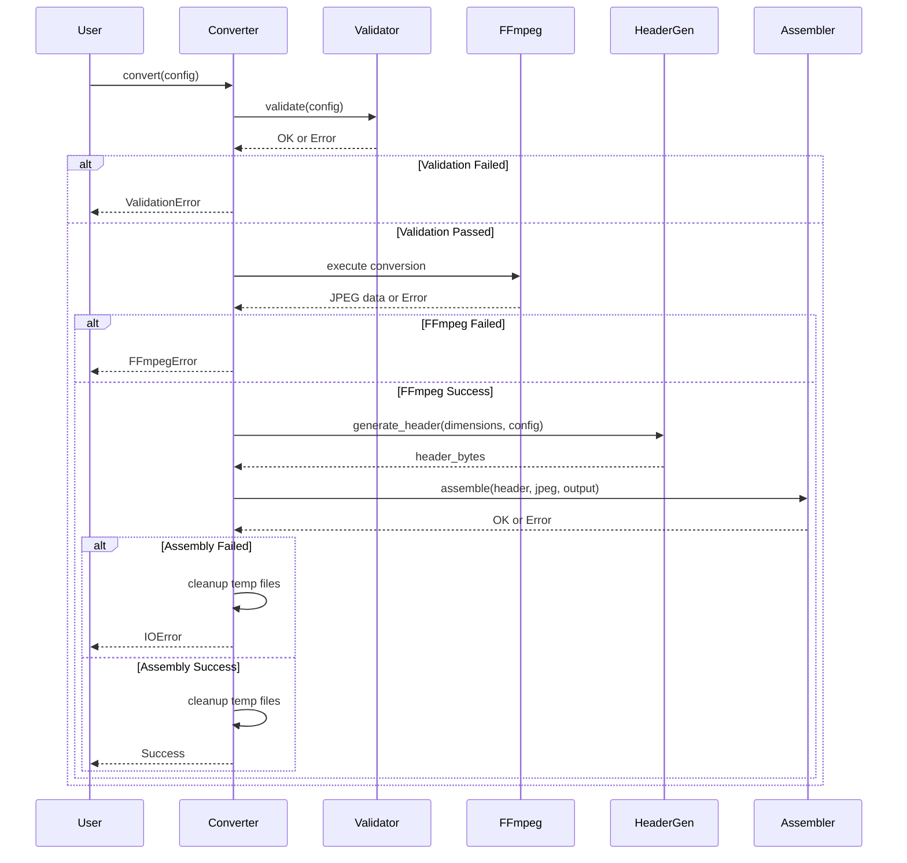
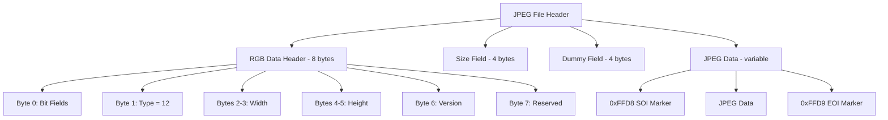

# Design Document: Image to JPEG Converter

## Overview

The Image to JPEG Converter is a TypeScript library and command-line tool that converts images to JPEG format with custom binary headers for embedded display systems. The system uses FFmpeg for image conversion and implements binary structure packing for proprietary header formats.

The library is designed for source code integration into other TypeScript/JavaScript projects, providing both a programmatic API and CLI interface.

The design follows a pipeline architecture:
1. Input validation and parameter parsing
2. FFmpeg-based image conversion with specified sampling and quality
3. Binary header generation with image metadata
4. Header and JPEG data integration into output file

## Architecture

### High-Level Architecture

```
┌─────────────┐
│   CLI/API   │
└──────┬──────┘
       │
       ▼
┌─────────────────┐
│  Input Validator│
└──────┬──────────┘
       │
       ▼
┌─────────────────┐
│ FFmpeg Executor │
└──────┬──────────┘
       │
       ▼
┌─────────────────┐
│ Header Generator│
└──────┬──────────┘
       │
       ▼
┌─────────────────┐
│  File Assembler │
└──────┬──────────┘
       │
       ▼
┌─────────────────┐
│  Output File    │
└─────────────────┘
```

### Component Responsibilities

- **CLI/API**: Parse command-line arguments or API parameters
- **Input Validator**: Validate all inputs before processing
- **FFmpeg Executor**: Build and execute FFmpeg commands
- **Header Generator**: Create binary header structures
- **File Assembler**: Combine header and JPEG data into output file

## Components and Interfaces

### 1. Configuration Model

Represents conversion parameters:

```
Structure ConversionConfig:
  input_path: String
  output_path: String
  sampling_factor: SamplingFactor (enum: 400, 420, 422, 444)
  quality: Integer (1-31)
  resize: ResizeOption (enum: None, Fifty, Seventy, Eighty)
  compress: Boolean
  version: Integer (default: 0)
```

### 2. Input Validator

Validates configuration before processing:

```
Interface InputValidator:
  Function validate(config: ConversionConfig) -> Result<Void, ValidationError>
    - Check input file exists and is readable
    - Validate quality range (1-31)
    - Validate sampling factor is valid enum value
    - Validate output path is writable
    - Return all validation errors together
```

### 3. FFmpeg Executor

Handles FFmpeg command construction and execution:

```
Interface FFmpegExecutor:
  Function convert(config: ConversionConfig, temp_output: String) -> Result<JpegData, FFmpegError>
    - Build FFmpeg command with parameters
    - Execute FFmpeg process
    - Capture stdout/stderr
    - Check exit code
    - Read resulting JPEG file
    - Return JPEG data or error
  
  Function build_command(config: ConversionConfig, output: String) -> List<String>
    - Map sampling_factor to pixel format:
      * 400 -> "gray"
      * 420 -> "yuvj420p"
      * 422 -> "yuvj422p"
      * 444 -> "yuvj444p"
    - Construct: ["ffmpeg", "-i", input, "-pix_fmt", format, "-q:v", quality, output]
```

### 4. Header Generator

Creates binary header structures:

```
Interface HeaderGenerator:
  Function generate_rgb_header(width: UInt16, height: UInt16, config: ConversionConfig) -> RgbDataHeader
    - Create 8-byte structure
    - Initialize all bit fields to 0 (scan, align, resize, compress, jpeg, idu, rsvd)
    - Set resize bits based on config (0=none, 1=50%, 2=70%, 3=80%)
    - Set compress bit if enabled in config
    - Set type = 12 (JPEG)
    - Set width and height
    - Set version and reserved fields to 0
  
  Function generate_jpeg_header(rgb_header: RgbDataHeader, jpeg_data: Bytes) -> JpegFileHeader
    - Include rgb_header
    - Calculate size from 0xFFD8 marker
    - Set dummy = 0
    - Append jpeg_data
  
  Function encode_to_bytes(header: JpegFileHeader) -> Bytes
    - Pack structure using little-endian byte order
    - Ensure no padding between fields
    - Return binary representation
```

### 5. File Assembler

Combines header and JPEG data:

```
Interface FileAssembler:
  Function assemble(header_bytes: Bytes, jpeg_data: Bytes, output_path: String) -> Result<Void, IOError>
    - Open output file for binary writing
    - Write header_bytes
    - Write jpeg_data
    - Flush and close file
    - Verify file was written successfully
```

### 6. Main Converter

Orchestrates the conversion pipeline:

```
Interface Converter:
  Function convert(config: ConversionConfig) -> Result<Void, ConversionError>
    - Validate input using InputValidator
    - Create temporary file path for FFmpeg output
    - Execute FFmpeg conversion
    - Extract image dimensions from JPEG data
    - Generate RGB header with dimensions
    - Generate JPEG file header
    - Encode header to bytes
    - Assemble final output file
    - Clean up temporary files
    - Return success or error
```

## Data Models

### Binary Structure Definitions

#### RgbDataHeader (8 bytes)

```
Byte 0 (bit fields, LSB to MSB):
  - scan: 1 bit (default 0)
  - align: 1 bit (default 0)
  - resize: 2 bits (0=none, 1=50%, 2=70%, 3=80%)
  - compress: 1 bit (0 or 1 based on config)
  - jpeg: 1 bit (default 0)
  - idu: 1 bit (default 0)
  - rsvd: 1 bit (default 0)

Byte 1:
  - type: uint8 (12 for JPEG)

Bytes 2-3:
  - w: uint16 (little-endian, image width)

Bytes 4-5:
  - h: uint16 (little-endian, image height)

Byte 6:
  - version: uint8

Byte 7:
  - rsvd2: uint8 (reserved, set to 0)
```

#### JpegFileHeader

```
Bytes 0-7:
  - img_header: RgbDataHeader (8 bytes)

Bytes 8-11:
  - size: uint32 (little-endian, JPEG size from 0xFFD8)

Bytes 12-15:
  - dummy: uint32 (alignment, set to 0)

Bytes 16+:
  - jpeg: variable length (JPEG data starting with 0xFFD8)
```

**Example Header Output**:

For a 72x72 pixel JPEG image with 1797 bytes of JPEG data:
```
Hex: 00 0c 48 00 48 00 00 00 05 07 00 00 00 00 00 00 ff d8 ff e0 ...
     |  |  |     |     |  |  |        |        |        |
     |  |  |     |     |  |  |        |        |        JPEG data starts
     |  |  |     |     |  |  |        |        dummy (0)
     |  |  |     |     |  |  |        size (1797 = 0x0705 little-endian)
     |  |  |     |     |  |  version (0), rsvd2 (0)
     |  |  |     |     height (72 = 0x0048 little-endian)
     |  |  |     width (72 = 0x0048 little-endian)
     |  type (12 = 0x0c for JPEG)
     bit fields (all 0)
```

### Error Types

```
Enum ConversionError:
  - ValidationError(details: String)
  - FFmpegError(exit_code: Integer, stderr: String)
  - IOError(message: String)
  - HeaderGenerationError(message: String)
  - InvalidJpegData(message: String)
```

## Correctness Properties

*A property is a characteristic or behavior that should hold true across all valid executions of a system—essentially, a formal statement about what the system should do. Properties serve as the bridge between human-readable specifications and machine-verifiable correctness guarantees.*


### Property 1: Valid JPEG Output

*For any* valid input image and conversion configuration, the system should produce a valid Baseline JPEG file that can be decoded by standard JPEG decoders.

**Validates: Requirements 1.1, 1.2**

### Property 2: Sampling Factor Mapping

*For any* valid sampling factor (400, 420, 422, 444), the system should generate an FFmpeg command with the correct corresponding pixel format (gray, yuvj420p, yuvj422p, yuvj444p respectively).

**Validates: Requirements 2.1**

### Property 3: Quality Parameter Validation

*For any* quality value in the range 1-31 inclusive, the system should accept it and pass it to FFmpeg; for any quality value outside this range, the system should reject it with an error.

**Validates: Requirements 3.2, 3.3**

### Property 4: Quality Parameter Propagation

*For any* specified quality value, the system should include it in the FFmpeg command with the correct flag (-q:v).

**Validates: Requirements 3.1**

### Property 5: Header Size Invariant

*For any* generated RGB_Data_Header, the binary representation should be exactly 8 bytes in length.

**Validates: Requirements 4.1**

### Property 6: JPEG Header Constants and Bit Fields

*For any* JPEG conversion, the generated RGB_Data_Header should have type field set to 12, and all bit fields (scan, align, jpeg, idu, rsvd) should be initialized to 0 unless specifically configured (resize and compress may be set based on configuration).

**Validates: Requirements 4.2, 4.5**

### Property 7: Image Dimension Accuracy

*For any* input image, the RGB_Data_Header width and height fields should exactly match the actual dimensions of the converted JPEG image.

**Validates: Requirements 4.3, 4.4**

### Property 8: Resize Option Mapping

*For any* resize option (None=0, Fifty=1, Seventy=2, Eighty=3), the RGB_Data_Header resize field should be set to the corresponding numeric value.

**Validates: Requirements 4.6**

### Property 9: Reserved Fields Initialization

*For any* generated RGB_Data_Header, all reserved fields (rsvd, rsvd2) should be initialized to 0.

**Validates: Requirements 4.8**

### Property 10: JPEG Size Calculation

*For any* JPEG data, the size field in the JPEG_File_Header should equal the byte count from the 0xFFD8 marker to the end of JPEG data, excluding the custom header bytes.

**Validates: Requirements 5.2, 5.3**

### Property 11: Dummy Field Invariant

*For any* generated JPEG_File_Header, the dummy field should always be set to 0.

**Validates: Requirements 5.4**

### Property 12: Output File Structure

*For any* successfully created output file, the file should start with the custom header (16 bytes minimum) immediately followed by JPEG data starting with 0xFFD8 marker.

**Validates: Requirements 6.1, 6.2, 6.3**

### Property 13: FFmpeg Command Completeness

*For any* conversion configuration, the constructed FFmpeg command should include all required parameters: input file, pixel format (-pix_fmt), quality (-q:v), and output file.

**Validates: Requirements 7.1**

### Property 14: FFmpeg Error Propagation

*For any* FFmpeg execution that returns a non-zero exit code, the system should return an error containing the exit code and stderr output.

**Validates: Requirements 7.3**

### Property 15: Input File Validation

*For any* input file path that does not exist, the system should return a validation error before attempting FFmpeg conversion.

**Validates: Requirements 8.1, 8.2**

### Property 16: Validation Before Execution

*For any* conversion request, all configuration validation should complete before FFmpeg is invoked.

**Validates: Requirements 8.4**

### Property 17: Little-Endian Encoding

*For any* multi-byte field (width, height, size) in the binary header, the bytes should be ordered in little-endian format.

**Validates: Requirements 9.1**

### Property 18: Field Size Correctness

*For any* generated header, the width and height fields should each be 2 bytes, and the size field should be 4 bytes.

**Validates: Requirements 9.2, 9.3**

### Property 19: No Padding Bytes

*For any* generated RGB_Data_Header, the total size should be exactly 8 bytes with no padding bytes between fields.

**Validates: Requirements 9.5**

### Property 20: Temporary File Cleanup

*For any* conversion that encounters an error, all temporary files created during the process should be removed.

**Validates: Requirements 10.1**

### Property 21: Atomic Output Creation

*For any* conversion that fails (FFmpeg error or header generation error), no output file should exist or partial output file should be removed.

**Validates: Requirements 10.2, 10.3**

### Property 22: Error Message Completeness

*For any* error condition, the error message should include both the failure reason and relevant context (file paths, parameter values, etc.).

**Validates: Requirements 10.4**

## Error Handling

### Error Categories

1. **Validation Errors**
   - Missing or non-existent input file
   - Invalid sampling factor
   - Quality value out of range
   - Invalid output path

2. **FFmpeg Errors**
   - FFmpeg not found in system PATH
   - Unsupported input format
   - FFmpeg execution failure
   - Output file not created

3. **Header Generation Errors**
   - Unable to read JPEG dimensions
   - Invalid JPEG data (missing 0xFFD8 marker)
   - JPEG data too large for header structure

4. **I/O Errors**
   - Unable to read input file
   - Unable to write output file
   - Unable to create temporary files
   - Disk space exhausted

### Error Handling Strategy

- **Fail Fast**: Validate all inputs before starting conversion
- **Descriptive Messages**: Include context (file paths, values) in error messages
- **Resource Cleanup**: Always clean up temporary files on error
- **Error Aggregation**: Report all validation errors together when possible
- **Atomic Operations**: Ensure output file is only created on complete success

### Cleanup Procedures

```
Function cleanup_on_error(temp_files: List<String>, output_file: String):
  For each temp_file in temp_files:
    Try:
      Delete temp_file
    Catch error:
      Log cleanup failure but continue
  
  If output_file exists:
    Try:
      Delete output_file
    Catch error:
      Log cleanup failure
```

## Testing Strategy

### Dual Testing Approach

The system will use both unit testing and property-based testing for comprehensive coverage:

- **Unit Tests**: Verify specific examples, edge cases, and error conditions
- **Property Tests**: Verify universal properties across all inputs

Both approaches are complementary and necessary. Unit tests catch concrete bugs in specific scenarios, while property tests verify general correctness across a wide range of inputs.

### Property-Based Testing

**Library Selection**: 
- Use `fast-check` library for TypeScript/JavaScript

**Configuration**:
- Each property test MUST run minimum 100 iterations
- Each test MUST be tagged with a comment referencing the design property
- Tag format: `# Feature: image-to-jpeg-converter, Property N: [property description]`

**Property Test Coverage**:
- Each correctness property (1-22) should be implemented as a single property-based test
- Generate random valid inputs (images, configurations) for testing
- Verify invariants hold across all generated inputs

### Unit Testing

**Focus Areas**:
- Specific examples of each sampling factor (400, 420, 422, 444)
- Boundary values for quality parameter (1, 31, 0, 32)
- Edge cases: empty files, corrupted images, very large images
- Error conditions: missing FFmpeg, invalid paths, disk full
- Integration: end-to-end conversion with various image formats

**Unit Test Balance**:
- Avoid writing too many unit tests for cases covered by property tests
- Focus on concrete examples that demonstrate correct behavior
- Test integration points between components
- Verify error messages are helpful and accurate

### Test Data

**Valid Test Images**:
- Small images (10x10 pixels)
- Medium images (640x480 pixels)
- Large images (4096x4096 pixels)
- Various formats: PNG, BMP, TIFF, GIF
- Grayscale and color images

**Invalid Test Cases**:
- Non-image files (text, binary)
- Corrupted image files
- Unsupported formats
- Empty files

### Integration Testing

**End-to-End Scenarios**:
1. Convert PNG to JPEG with 420 sampling and quality 10
2. Convert BMP to JPEG with 444 sampling and quality 2
3. Convert grayscale image with 400 sampling
4. Convert with resize options (50%, 70%, 80%)
5. Verify output file can be read by embedded system parser

**Verification Steps**:
1. Run conversion
2. Verify output file exists
3. Parse header structure
4. Verify header fields match configuration
5. Extract JPEG data
6. Verify JPEG data is valid and decodable
7. Verify dimensions match original image

### Mock Testing

**FFmpeg Mocking**:
- Mock FFmpeg execution for unit tests
- Provide pre-generated JPEG files as FFmpeg output
- Test error handling without requiring FFmpeg installation
- Verify correct command construction

**File System Mocking**:
- Mock file I/O for testing error conditions
- Simulate disk full, permission denied, etc.
- Verify cleanup procedures work correctly

## Implementation Notes

### Language Considerations

The system is implemented in **TypeScript** for the following reasons:
- Strong typing for binary data structures
- Excellent FFmpeg integration via child_process
- Buffer API for binary data manipulation
- Easy integration into Node.js projects
- Source code can be easily incorporated into other TypeScript/JavaScript projects

**TypeScript-Specific Implementation Details**:
- Use `Buffer` for binary data manipulation
- Use `child_process.spawn` or `child_process.exec` for FFmpeg execution
- Use `fs` module for file I/O
- Export ES modules for modern JavaScript projects
- Provide TypeScript type definitions (.d.ts) for all public APIs

### Dependencies

**Required**:
- FFmpeg (external dependency, must be installed)
- Node.js (runtime environment)

**Optional**:
- sharp (Node.js image processing library for dimension extraction)
- fast-check (property-based testing library for TypeScript)

### Performance Considerations

- FFmpeg conversion is the bottleneck (I/O and encoding)
- Header generation is negligible (< 1ms)
- File assembly is I/O bound
- Consider streaming for very large files
- Temporary files should be cleaned up promptly

### Security Considerations

- Validate input file paths to prevent directory traversal
- Limit maximum file size to prevent resource exhaustion
- Sanitize FFmpeg command parameters to prevent injection
- Ensure temporary files are created with secure permissions
- Clean up temporary files even on crashes (use try-finally or defer)

### Portability

- Use platform-independent path handling
- Detect FFmpeg location (PATH search)
- Handle different FFmpeg versions gracefully
- Test on Windows, Linux, and macOS
- Use binary mode for all file operations

## Source Code Integration

### Module Structure

The library should be organized as follows:

```
image-to-jpeg-converter/
├── src/
│   ├── index.ts              # Main entry point, exports public API
│   ├── converter.ts          # Main Converter class
│   ├── validator.ts          # Input validation
│   ├── ffmpeg-executor.ts    # FFmpeg command execution
│   ├── header-generator.ts   # Binary header generation
│   ├── file-assembler.ts     # File assembly
│   ├── types.ts              # TypeScript type definitions
│   └── cli.ts                # Command-line interface
├── tests/
│   ├── unit/                 # Unit tests
│   └── properties/           # Property-based tests
├── docs/
│   ├── README.md             # Quick start guide
│   ├── INTEGRATION.md        # Integration instructions
│   └── API.md                # API reference
├── package.json
└── tsconfig.json
```

### Public API Design

The library should export a clean, typed API:

```typescript
// Main conversion function
export async function convertToJpeg(
  config: ConversionConfig
): Promise<ConversionResult>;

// Configuration interface
export interface ConversionConfig {
  inputPath: string;
  outputPath: string;
  samplingFactor: SamplingFactor;
  quality?: number;
  resize?: ResizeOption;
  compress?: boolean;
  version?: number;
}

// Enums
export enum SamplingFactor {
  Grayscale = 400,
  YUV420 = 420,
  YUV422 = 422,
  YUV444 = 444
}

export enum ResizeOption {
  None = 0,
  Fifty = 1,
  Seventy = 2,
  Eighty = 3
}

// Result types
export interface ConversionResult {
  success: boolean;
  outputPath: string;
  jpegSize: number;
  dimensions: { width: number; height: number };
}

export interface ConversionError {
  type: 'validation' | 'ffmpeg' | 'io' | 'header';
  message: string;
  details?: any;
}
```

### Integration Documentation

**INTEGRATION.md** should include:
1. How to copy source files into target project
2. Required dependencies (FFmpeg, Node.js version)
3. TypeScript configuration requirements
4. Build and compilation instructions
5. Example integration in different project types (Express, CLI, etc.)

**README.md** should include:
1. Quick start example
2. Installation instructions
3. Basic usage examples
4. Configuration options
5. Error handling examples
6. Link to full documentation

**API.md** should include:
1. Complete API reference with JSDoc
2. All exported types and interfaces
3. Usage examples for each function
4. Error handling patterns
5. Advanced configuration options

### Usage Examples

The documentation should include examples for common scenarios:

1. **Basic Conversion**:
```typescript
import { convertToJpeg, SamplingFactor } from './image-to-jpeg-converter';

const result = await convertToJpeg({
  inputPath: 'input.png',
  outputPath: 'output.jpg',
  samplingFactor: SamplingFactor.YUV420,
  quality: 10
});
```

2. **With Resize Option**:
```typescript
const result = await convertToJpeg({
  inputPath: 'input.png',
  outputPath: 'output.jpg',
  samplingFactor: SamplingFactor.YUV422,
  quality: 5,
  resize: ResizeOption.Fifty
});
```

3. **Error Handling**:
```typescript
try {
  const result = await convertToJpeg(config);
  console.log(`Converted: ${result.outputPath}`);
} catch (error) {
  if (error.type === 'validation') {
    console.error('Invalid input:', error.message);
  } else if (error.type === 'ffmpeg') {
    console.error('FFmpeg error:', error.details);
  }
}
```

4. **CLI Usage**:
```bash
# Basic conversion
image-to-jpeg -i input.png -o output.jpg -s 420 -q 10

# With resize
image-to-jpeg -i input.png -o output.jpg -s 422 -q 5 -r 50

# Grayscale
image-to-jpeg -i input.png -o output.jpg -s 400 -q 20
```

## Mermaid Diagrams

### Conversion Flow



### Binary Header Structure


