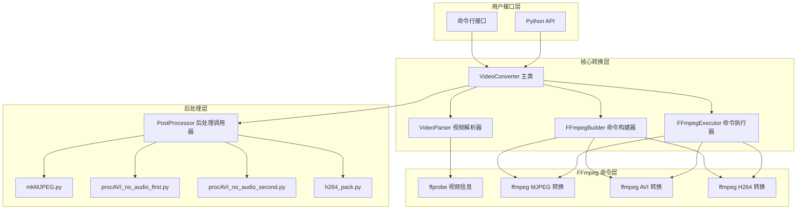

# 设计文档

## 概述

本设计文档描述了基于 FFmpeg 的视频转换工具的架构和实现细节。该工具使用系统环境中的 ffmpeg 命令行工具进行视频格式转换，支持将常见视频格式转换为 MJPEG、AVI-MJPEG 和 H264 格式，并调用现有的后处理脚本完成最终封装。

核心设计原则：
- 使用系统 ffmpeg/ffprobe 命令，不依赖 OpenCV 或 DLL
- 两步转换流程：ffmpeg 转换 + 脚本后处理
- 跨平台兼容（Linux 和 Windows）
- 支持命令行和编程两种使用方式

## 架构



## 组件和接口

### 1. VideoConverter 主类

主入口类，协调整个转换流程。

```python
class VideoConverter:
    """视频转换器主类"""
    
    def __init__(self, progress_callback: Optional[Callable[[int, int], None]] = None):
        """
        初始化转换器
        
        Args:
            progress_callback: 进度回调函数，接收 (current_frame, total_frames)
        """
        pass
    
    def get_video_info(self, input_path: str) -> VideoInfo:
        """
        获取视频信息
        
        Args:
            input_path: 输入视频文件路径
            
        Returns:
            VideoInfo 对象，包含宽度、高度、帧率、帧数等信息
            
        Raises:
            FileNotFoundError: 文件不存在
            VideoFormatError: 不支持的视频格式
            FFmpegNotFoundError: ffmpeg/ffprobe 未安装
        """
        pass
    
    def convert(self, input_path: str, output_path: str, 
                output_format: OutputFormat,
                frame_rate: Optional[float] = None,
                quality: int = 5) -> ConversionResult:
        """
        执行视频转换
        
        Args:
            input_path: 输入视频文件路径
            output_path: 输出文件路径
            output_format: 输出格式 (MJPEG, AVI_MJPEG, H264)
            frame_rate: 目标帧率，None 表示保持原帧率
            quality: MJPEG/AVI 质量 (1-31，1最高) 或 H264 CRF 值
            
        Returns:
            ConversionResult 对象，包含转换状态和输出信息
        """
        pass
```

### 2. VideoParser 视频解析器

使用 ffprobe 解析视频元数据。

```python
class VideoParser:
    """视频解析器 - 使用 ffprobe"""
    
    def parse(self, input_path: str) -> VideoInfo:
        """
        解析视频文件，返回视频信息
        
        使用 ffprobe 命令:
        ffprobe -v quiet -print_format json -show_streams -show_format <input>
        """
        pass
```

### 3. FFmpegBuilder 命令构建器

构建不同格式转换的 ffmpeg 命令。

```python
class FFmpegBuilder:
    """FFmpeg 命令构建器"""
    
    def build_mjpeg_frames_cmd(
        self, 
        input_path: str, 
        output_dir: str,
        frame_rate: Optional[float] = None,
        quality: int = 5
    ) -> List[str]:
        """
        构建 MJPEG 帧提取命令
        
        命令格式:
        ffmpeg -i input.mp4 -r 24 -vf "format=yuvj420p" -q:v 5 output/frame_%04d.jpg
        """
        pass
    
    def build_avi_cmd(
        self,
        input_path: str,
        output_path: str,
        frame_rate: Optional[float] = None,
        quality: int = 5
    ) -> List[str]:
        """
        构建 AVI-MJPEG 转换命令
        
        命令格式:
        ffmpeg -i input.mp4 -an -r 25 -vcodec mjpeg -pix_fmt yuvj420p -q:v 5 output.avi
        """
        pass
    
    def build_h264_cmd(
        self,
        input_path: str,
        output_path: str,
        frame_rate: Optional[float] = None,
        crf: int = 23
    ) -> List[str]:
        """
        构建 H264 转换命令
        
        命令格式:
        ffmpeg -r 30 -i input.mp4 -c:v libx264 -x264-params "cabac=0:..." -an -f rawvideo output.h264
        """
        pass
```

### 4. FFmpegExecutor 命令执行器

执行 ffmpeg 命令并处理输出。

```python
class FFmpegExecutor:
    """FFmpeg 命令执行器"""
    
    def __init__(self, progress_callback: Optional[Callable[[int, int], None]] = None):
        pass
    
    def execute(self, cmd: List[str], total_frames: int = 0) -> subprocess.CompletedProcess:
        """
        执行 ffmpeg 命令
        
        Args:
            cmd: 命令参数列表
            total_frames: 总帧数（用于进度计算）
            
        Returns:
            执行结果
            
        Raises:
            FFmpegError: ffmpeg 执行失败
        """
        pass
    
    @staticmethod
    def check_ffmpeg_available() -> bool:
        """检查 ffmpeg 是否可用"""
        pass
```

### 5. PostProcessor 后处理调用器

```python
class PostProcessor:
    """后处理脚本调用器"""
    
    @staticmethod
    def process_mjpeg(input_dir: str, output_path: str) -> None:
        """调用 mkMJPEG.py 处理 MJPEG"""
        pass
    
    @staticmethod
    def process_avi(input_path: str, output_path: str) -> None:
        """依次调用 procAVI_no_audio_first.py 和 procAVI_no_audio_second.py"""
        pass
    
    @staticmethod
    def process_h264(input_path: str, output_path: str, fps: float) -> None:
        """调用 h264_pack.py 添加自定义头部"""
        pass
```

## 数据模型

```python
from dataclasses import dataclass
from enum import Enum
from typing import Optional


class OutputFormat(Enum):
    """输出格式枚举"""
    MJPEG = "mjpeg"
    AVI_MJPEG = "avi_mjpeg"
    H264 = "h264"


@dataclass
class VideoInfo:
    """视频信息"""
    width: int
    height: int
    frame_rate: float
    frame_count: int
    duration: float  # 秒
    codec: str
    file_path: str


@dataclass
class ConversionResult:
    """转换结果"""
    success: bool
    input_path: str
    output_path: str
    output_format: OutputFormat
    frame_count: int
    frame_rate: float
    quality: int
    error_message: Optional[str] = None


@dataclass
class MjpegFrame:
    """MJPEG 帧数据"""
    index: int
    offset: int
    size: int
    data: bytes
```

## 正确性属性

*属性是系统在所有有效执行中应保持为真的特征或行为——本质上是关于系统应该做什么的形式化陈述。属性作为人类可读规格和机器可验证正确性保证之间的桥梁。*

基于验收标准分析和属性反思，以下是经过去重合并的正确性属性：

### 属性 1：视频信息结构完整性

*对于任意* 有效的视频文件，解析返回的 VideoInfo 对象应包含所有必需字段（width、height、frame_rate、frame_count），且所有数值字段为正数。

**验证: 需求 1.1, 1.4**

### 属性 2：不存在文件的错误处理

*对于任意* 不存在的文件路径字符串，调用 get_video_info 应抛出 FileNotFoundError 异常。

**验证: 需求 1.2**

### 属性 3：FFmpeg 命令参数完整性

*对于任意* 转换参数组合（格式、帧率、质量），构建的 ffmpeg 命令应包含所有必需的参数：
- MJPEG: `-vf "format=yuvj420p"`, `-q:v`, `-r`（如指定帧率）
- AVI: `-an`, `-vcodec mjpeg`, `-pix_fmt yuvj420p`, `-q:v`, `-r`
- H264: `-c:v libx264`, `-x264-params`, `-an`, `-f rawvideo`, `-r`

**验证: 需求 2.1, 2.2, 2.3, 3.1, 3.2, 3.3, 4.1, 4.2, 4.3**

### 属性 4：质量参数传递正确性

*对于任意* 指定的质量值，构建的 ffmpeg 命令中 `-q:v` 参数（MJPEG/AVI）或 `crf=` 参数（H264）应与输入值一致。

**验证: 需求 2.3, 3.3, 4.5**

### 属性 5：帧率参数传递正确性

*对于任意* 指定的帧率值，构建的 ffmpeg 命令中 `-r` 参数应与输入值一致。

**验证: 需求 2.2, 3.2, 4.2**

### 属性 6：MJPEG 8 字节对齐

*对于任意* 生成的 MJPEG 文件，解析出的每个 JPEG 帧的起始偏移量应为 8 的倍数。

**验证: 需求 2.5**

### 属性 7：AVI-MJPEG 8 字节对齐

*对于任意* 生成的 AVI-MJPEG 文件，每个 JPEG 帧数据的起始偏移量应为 8 的倍数。

**验证: 需求 3.5**

### 属性 8：API 返回结构完整性

*对于任意* 有效的转换参数，convert 函数返回的 ConversionResult 对象应包含所有必需字段，且 success 为 True 时 output_path 指向存在的文件。

**验证: 需求 6.2**

### 属性 9：无效参数异常处理

*对于任意* 无效的转换参数（如不存在的输入文件、无效的输出格式），convert 函数应抛出适当的异常而非返回错误结果。

**验证: 需求 6.3**

### 属性 10：进度回调单调递增

*对于任意* 转换过程，进度回调接收的 current_frame 值应单调递增，且最终值等于 total_frames。

**验证: 需求 6.4**

### 属性 11：MJPEG 往返一致性

*对于任意* 有效的 MJPEG 帧序列，写入后再解析应能恢复出与原始帧内容相同的数据。

**验证: 需求 8.3**

### 属性 12：CLI 无效参数错误处理

*对于任意* 无效的命令行参数组合，CLI 应输出包含错误描述的信息并以非零状态码退出。

**验证: 需求 5.3**

### 属性 13：可选参数传递正确性

*对于任意* 指定的可选参数（帧率、质量），转换结果中的对应字段应与输入参数一致。

**验证: 需求 5.5**

## 错误处理

### 异常类型

```python
class VideoConverterError(Exception):
    """视频转换器基础异常"""
    pass


class FileNotFoundError(VideoConverterError):
    """文件不存在"""
    pass


class VideoFormatError(VideoConverterError):
    """不支持的视频格式"""
    pass


class FFmpegNotFoundError(VideoConverterError):
    """FFmpeg 未安装或不在 PATH 中"""
    pass


class FFmpegError(VideoConverterError):
    """FFmpeg 执行错误"""
    pass


class PostProcessError(VideoConverterError):
    """后处理脚本执行错误"""
    pass
```

### 错误处理策略

1. **FFmpeg 检查**：启动时检查 ffmpeg/ffprobe 是否可用
2. **输入验证**：在转换开始前验证所有输入参数
3. **文件检查**：验证输入文件存在且可读
4. **命令执行**：捕获 ffmpeg 执行错误并提供详细信息
5. **资源清理**：转换失败时清理临时文件

## 测试策略

### 单元测试

- 测试 FFmpegBuilder 命令构建逻辑
- 测试 VideoParser 解析逻辑
- 测试错误处理和异常
- 使用 pytest 框架

### 属性测试

- 使用 **hypothesis** 库进行属性测试
- 每个属性测试运行至少 100 次迭代
- 测试标注格式：`**Feature: video-converter-ffmpeg, Property {number}: {property_text}**`

### 测试覆盖

| 组件 | 单元测试 | 属性测试 |
|------|----------|----------|
| VideoParser | ffprobe 解析、错误处理 | 属性 1, 2 |
| FFmpegBuilder | 命令构建验证 | 属性 3, 4, 5 |
| MjpegParser | 帧解析、对齐验证 | 属性 6, 11 |
| AviParser | AVI 结构、对齐 | 属性 7 |
| VideoConverter | API 完整性 | 属性 8, 9, 10, 13 |
| CLI | 参数解析 | 属性 12 |

## FFmpeg 命令参考

### MJPEG 帧提取
```bash
ffmpeg -i input.mp4 -r 24 -vf "format=yuvj420p" -q:v 5 output/frame_%04d.jpg
```

### AVI-MJPEG 转换
```bash
ffmpeg -i input.mp4 -an -r 25 -vcodec mjpeg -pix_fmt yuvj420p -q:v 5 output.avi
```

### H264 转换
```bash
ffmpeg -r 30 -i input.mp4 -c:v libx264 -x264-params "cabac=0:ref=3:deblock=1:0:0:analyse=0x1:0x111:me=hex:subme=7:psy=1:psy_rd=1.0:0.0:mixed_ref=1:me_range=16:chroma_me=1:trellis=1:8x8dct=0:deadzone-inter=21:deadzone-intra=11:fast_pskip=1:chroma_qp_offset=-2:threads=11:lookahead_threads=1:sliced_threads=0:nr=0:decimate=1:interlaced=0:bluray_compat=0:constrained_intra=0:bframes=0:weightp=0:keyint=40:min-keyint=4:scenecut=40:intra_refresh=0:rc_lookahead=40:mbtree=1:crf=23:qcomp=0.60:qpmin=0:qpmax=69:qpstep=4:ipratio=1.40:aq-mode=1:aq-strength=1.00" -an -f rawvideo output.h264
```

## 依赖

```
hypothesis>=6.0.0       # 属性测试
pytest>=7.0.0           # 测试框架
```

**系统依赖：**
- ffmpeg（需在系统 PATH 中）
- ffprobe（需在系统 PATH 中）

## 文件结构

```
video_converter/
├── __init__.py
├── __main__.py         # 入口点
├── converter.py        # VideoConverter 主类
├── parser.py           # VideoParser 视频解析器
├── ffmpeg_builder.py   # FFmpegBuilder 命令构建器
├── ffmpeg_executor.py  # FFmpegExecutor 命令执行器
├── postprocess.py      # PostProcessor
├── models.py           # 数据模型
├── exceptions.py       # 异常定义
├── cli.py              # 命令行接口
└── mjpeg_parser.py     # MJPEG 解析器（用于往返测试）

tests/
├── __init__.py
├── test_parser.py
├── test_ffmpeg_builder.py
├── test_converter.py
├── test_cli.py
└── conftest.py         # pytest 配置和 fixtures
```
