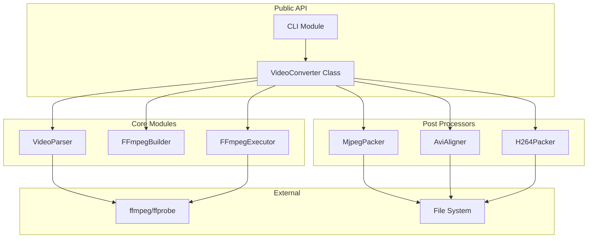

# Design Document: Video Converter TypeScript

## Overview

本设计文档描述将 Python 视频转换器重构为 TypeScript 版本的技术方案。系统使用 Node.js 运行时，通过调用 FFmpeg/FFprobe 命令行工具实现视频转换，并提供 MJPEG、AVI-MJPEG 和 H264 三种输出格式的后处理功能。

### 设计目标

1. **功能等价**: 保持与 Python 版本完全相同的功能和输出
2. **类型安全**: 充分利用 TypeScript 类型系统
3. **模块化**: 清晰的模块边界和职责分离
4. **跨平台**: 支持 Linux 和 Windows
5. **可测试**: 便于单元测试和属性测试

## Architecture



### 目录结构

```
video-converter-ts/
├── src/
│   ├── index.ts              # 公共 API 导出
│   ├── converter.ts          # VideoConverter 主类
│   ├── parser.ts             # VideoParser 视频解析
│   ├── ffmpeg-builder.ts     # FFmpeg 命令构建
│   ├── ffmpeg-executor.ts    # FFmpeg 命令执行
│   ├── postprocess/
│   │   ├── index.ts          # 后处理器导出
│   │   ├── mjpeg-packer.ts   # MJPEG 打包
│   │   ├── avi-aligner.ts    # AVI 对齐
│   │   └── h264-packer.ts    # H264 打包
│   ├── models.ts             # 数据模型定义
│   ├── errors.ts             # 异常类定义
│   └── cli.ts                # 命令行接口
├── tests/
│   ├── parser.test.ts
│   ├── ffmpeg-builder.test.ts
│   ├── mjpeg-packer.test.ts
│   ├── avi-aligner.test.ts
│   ├── h264-packer.test.ts
│   └── properties/           # 属性测试
├── package.json
├── tsconfig.json
└── README.md
```

## Components and Interfaces

### 1. 数据模型 (models.ts)

```typescript
// 输出格式枚举
export enum OutputFormat {
  MJPEG = 'mjpeg',
  AVI_MJPEG = 'avi_mjpeg',
  H264 = 'h264'
}

// 视频信息
export interface VideoInfo {
  width: number;
  height: number;
  frameRate: number;
  frameCount: number;
  duration: number;  // 秒
  codec: string;
  filePath: string;
}

// 转换结果
export interface ConversionResult {
  success: boolean;
  inputPath: string;
  outputPath: string;
  outputFormat: OutputFormat;
  frameCount: number;
  frameRate: number;
  quality: number;
  errorMessage?: string;
}

// 进度回调类型
export type ProgressCallback = (current: number, total: number) => void;

// 转换选项
export interface ConversionOptions {
  frameRate?: number;
  quality?: number;
}
```

### 2. 异常类 (errors.ts)

```typescript
export class VideoConverterError extends Error {
  constructor(message: string) {
    super(message);
    this.name = 'VideoConverterError';
  }
}

export class VideoFormatError extends VideoConverterError {
  constructor(message: string) {
    super(message);
    this.name = 'VideoFormatError';
  }
}

export class FFmpegNotFoundError extends VideoConverterError {
  constructor(message: string) {
    super(message);
    this.name = 'FFmpegNotFoundError';
  }
}

export class FFmpegError extends VideoConverterError {
  constructor(message: string) {
    super(message);
    this.name = 'FFmpegError';
  }
}

export class PostProcessError extends VideoConverterError {
  constructor(message: string) {
    super(message);
    this.name = 'PostProcessError';
  }
}
```

### 3. VideoParser (parser.ts)

```typescript
export class VideoParser {
  private ffprobeCmd: string;
  
  constructor() {
    this.ffprobeCmd = process.platform === 'win32' ? 'ffprobe.exe' : 'ffprobe';
  }
  
  async parse(inputPath: string): Promise<VideoInfo>;
  private async checkFfprobeAvailable(): Promise<boolean>;
  private async runFfprobe(inputPath: string): Promise<FfprobeOutput>;
  private findVideoStream(data: FfprobeOutput): FfprobeStream;
  private parseFrameRate(stream: FfprobeStream): number;
  private parseFrameCount(stream: FfprobeStream, format: FfprobeFormat, 
                          frameRate: number, duration: number): number;
}

// ffprobe JSON 输出类型
interface FfprobeOutput {
  streams: FfprobeStream[];
  format: FfprobeFormat;
}

interface FfprobeStream {
  codec_type: string;
  codec_name?: string;
  width?: number;
  height?: number;
  avg_frame_rate?: string;
  r_frame_rate?: string;
  nb_frames?: string;
  duration?: string;
}

interface FfprobeFormat {
  duration?: string;
}
```

### 4. FFmpegBuilder (ffmpeg-builder.ts)

```typescript
export class FFmpegBuilder {
  // H264 编码参数（与 Python 版本相同）
  private static readonly H264_X264_PARAMS = 
    'cabac=0:ref=3:deblock=1:0:0:analyse=0x1:0x111:me=hex:subme=7:' +
    'psy=1:psy_rd=1.0:0.0:mixed_ref=1:me_range=16:chroma_me=1:' +
    'trellis=1:8x8dct=0:deadzone-inter=21:deadzone-intra=11:' +
    'fast_pskip=1:chroma_qp_offset=-2:threads=11:lookahead_threads=1:' +
    'sliced_threads=0:nr=0:decimate=1:interlaced=0:bluray_compat=0:' +
    'constrained_intra=0:bframes=0:weightp=0:keyint=40:min-keyint=4:' +
    'scenecut=40:intra_refresh=0:rc_lookahead=40:mbtree=1:' +
    'crf={crf}:qcomp=0.60:qpmin=0:qpmax=69:qpstep=4:ipratio=1.40:' +
    'aq-mode=1:aq-strength=1.00';
  
  buildMjpegFramesCmd(inputPath: string, outputDir: string, 
                      frameRate?: number, quality?: number): string[];
  buildAviCmd(inputPath: string, outputPath: string,
              frameRate?: number, quality?: number): string[];
  buildH264Cmd(inputPath: string, outputPath: string,
               frameRate?: number, crf?: number): string[];
}
```

### 5. FFmpegExecutor (ffmpeg-executor.ts)

```typescript
export class FFmpegExecutor {
  private progressCallback?: ProgressCallback;
  
  constructor(progressCallback?: ProgressCallback);
  
  static checkFfmpegAvailable(): Promise<boolean>;
  static checkFfprobeAvailable(): Promise<boolean>;
  
  async execute(cmd: string[], totalFrames?: number): Promise<void>;
  private executeWithProgress(cmd: string[], totalFrames: number): Promise<void>;
  private executeSimple(cmd: string[]): Promise<void>;
}
```

### 6. MjpegPacker (postprocess/mjpeg-packer.ts)

```typescript
export class MjpegPacker {
  // 8 字节对齐
  private static readonly ALIGNMENT = 8;
  
  async pack(inputDir: string, outputPath: string): Promise<void>;
  
  // JPEG 处理方法
  private isBaselineJpeg(data: Buffer): boolean;
  private findApp1InsertPosition(data: Buffer): App1Info;
  private padJpegViaApp1(data: Buffer): Buffer;
  private calculatePadding(size: number): number;
}

interface App1Info {
  type: 'exist' | 'new';
  start: number;
  end: number;
}
```

### 7. AviAligner (postprocess/avi-aligner.ts)

```typescript
export class AviAligner {
  // 第一步：调整 JUNK 块对齐首帧
  async alignFirstFrame(inputPath: string, outputPath: string): Promise<void>;
  
  // 第二步：对齐所有帧
  async alignAllFrames(inputPath: string, outputPath: string): Promise<void>;
  
  // 完整处理流程
  async process(inputPath: string, outputPath: string): Promise<void>;
  
  // AVI 解析方法
  private findRootChunks(fd: number): Promise<RiffInfo>;
  private findMoviChunks(fd: number, moviOffset: number, moviSize: number): Promise<ChunkInfo[]>;
  private readChunkHeader(fd: number, offset: number): Promise<ChunkHeader>;
}

interface RiffInfo {
  size: number;
  end: number;
  type: string;
  chunks: ChunkInfo[];
}

interface ChunkInfo {
  id: string;
  offset: number;
  size: number;
  dataOffset: number;
}

interface ChunkHeader {
  id: string;
  size: number;
  dataOffset: number;
}
```

### 8. H264Packer (postprocess/h264-packer.ts)

```typescript
export class H264Packer {
  async pack(inputPath: string, outputPath: string, fps: number): Promise<void>;
  
  // NAL 单元解析
  private findStartCodePos(data: Buffer, start?: number): StartCodeInfo;
  private nextNalBounds(data: Buffer, start?: number): NalBounds;
  private ebspToRbsp(ebsp: Buffer): Buffer;
  
  // SPS 解析
  private parseSpsPayload(payload: Buffer): SpsInfo;
  
  // 帧计数
  private countFrames(data: Buffer): number;
  private parseSliceHeaderFields(payload: Buffer): SliceHeaderInfo;
  
  // 头部构建
  private buildHeader(width: number, height: number, frameCount: number, 
                      fps: number, dataSize: number): Buffer;
}

interface StartCodeInfo {
  position: number;
  length: number;  // 3 或 4
}

interface NalBounds {
  start: number;
  headerPos: number | null;
  payloadStart: number | null;
  payloadEnd: number | null;
}

interface SpsInfo {
  width: number;
  height: number;
}

interface SliceHeaderInfo {
  firstMbInSlice: number;
  sliceType: number;
}

// 比特流读取器
class BitReader {
  constructor(data: Buffer);
  readBits(n: number): number;
  readBit(): number;
  readUe(): number;  // Exp-Golomb 无符号
  readSe(): number;  // Exp-Golomb 有符号
}
```

### 9. VideoConverter (converter.ts)

```typescript
export class VideoConverter {
  private parser: VideoParser;
  private builder: FFmpegBuilder;
  private executor: FFmpegExecutor;
  private progressCallback?: ProgressCallback;
  
  constructor(progressCallback?: ProgressCallback);
  
  async getVideoInfo(inputPath: string): Promise<VideoInfo>;
  
  async convert(inputPath: string, outputPath: string, 
                outputFormat: OutputFormat, 
                options?: ConversionOptions): Promise<ConversionResult>;
  
  private convertToMjpeg(inputPath: string, outputPath: string,
                         videoInfo: VideoInfo, targetFps: number,
                         quality: number): Promise<ConversionResult>;
  
  private convertToAviMjpeg(inputPath: string, outputPath: string,
                            videoInfo: VideoInfo, targetFps: number,
                            quality: number): Promise<ConversionResult>;
  
  private convertToH264(inputPath: string, outputPath: string,
                        videoInfo: VideoInfo, targetFps: number,
                        crf: number): Promise<ConversionResult>;
}
```

### 10. CLI (cli.ts)

```typescript
interface CliArgs {
  input: string;
  output?: string;
  format?: 'mjpeg' | 'avi_mjpeg' | 'h264';
  framerate?: number;
  quality?: number;
  info?: boolean;
  verbose?: boolean;
}

export function parseArgs(args: string[]): CliArgs;
export function printVideoInfo(info: VideoInfo): void;
export function printProgress(current: number, total: number): void;
export function printResult(result: ConversionResult): void;
export async function main(args?: string[]): Promise<number>;
```

## Data Models

### 二进制数据格式

#### H264 自定义头部格式 (24 字节)

| 偏移 | 大小 | 类型 | 描述 |
|------|------|------|------|
| 0 | 4 | char[4] | 魔数 "H264" |
| 4 | 4 | uint32_le | 视频宽度 |
| 8 | 4 | uint32_le | 视频高度 |
| 12 | 4 | uint32_le | 帧数 |
| 16 | 4 | uint32_le | 帧时间 (ms) |
| 20 | 4 | uint32_le | 数据大小 |

#### JPEG APP1 段格式

| 偏移 | 大小 | 描述 |
|------|------|------|
| 0 | 2 | 标记 0xFF 0xE1 |
| 2 | 2 | 段长度 (big-endian) |
| 4 | 4 | 标识符 "EXIF" |
| 8 | N | 填充字节 0x00 |

#### AVI RIFF 结构

```
RIFF (size) 'AVI '
├── LIST (size) 'hdrl'
│   ├── avih (size) [主头部]
│   └── LIST (size) 'strl'
│       ├── strh (size) [流头部]
│       └── strf (size) [流格式]
├── JUNK (size) [填充块 - 用于对齐]
├── LIST (size) 'movi'
│   ├── 00dc (size) [视频帧数据]
│   ├── 00dc (size) [视频帧数据]
│   └── ...
└── idx1 (size) [索引块]
```


## Correctness Properties

*A property is a characteristic or behavior that should hold true across all valid executions of a system—essentially, a formal statement about what the system should do. Properties serve as the bridge between human-readable specifications and machine-verifiable correctness guarantees.*

### Property 1: Frame Rate Parsing

*For any* valid frame rate string in either fraction format (e.g., "30000/1001") or decimal format (e.g., "29.97"), the parser SHALL correctly convert it to a floating-point number representing frames per second.

**Validates: Requirements 1.5**

### Property 2: Frame Count Calculation

*For any* video with duration D seconds and frame rate R fps, when nb_frames is not available, the calculated frame count SHALL equal floor(D * R).

**Validates: Requirements 1.6**

### Property 3: FFmpeg Command Structure

*For any* valid input parameters (input path, output path, frame rate, quality), the FFmpeg command builder SHALL generate commands that:
- For MJPEG: contain "-vf", "format=yuvj420p", "-q:v", and output pattern
- For AVI: contain "-vcodec", "mjpeg", "-an", "-pix_fmt", "yuvj420p"
- For H264: contain "-c:v", "libx264", "-x264-params", "-f", "rawvideo"
- When frame rate is specified: contain "-r" followed by the rate value

**Validates: Requirements 2.1, 2.2, 2.3, 2.4**

### Property 4: Progress Callback Parsing

*For any* FFmpeg stderr output containing "frame=N" pattern, the executor SHALL invoke the progress callback with the parsed frame number N and the total frame count.

**Validates: Requirements 3.4**

### Property 5: Command Overwrite Flag

*For any* FFmpeg command executed through the executor, the command SHALL include the "-y" flag to enable automatic file overwriting.

**Validates: Requirements 3.5**

### Property 6: JPEG 8-Byte Alignment

*For any* baseline JPEG image processed by the MJPEG packer, the output size SHALL be divisible by 8 (8-byte aligned).

**Validates: Requirements 4.3, 4.4, 4.5**

### Property 7: MJPEG Concatenation Integrity

*For any* set of JPEG frames, the MJPEG output SHALL be the concatenation of all padded frames in sorted filename order, and each frame SHALL be extractable by finding JPEG SOI (0xFFD8) and EOI (0xFFD9) markers.

**Validates: Requirements 4.1, 4.6**

### Property 8: AVI Frame Alignment

*For any* AVI file processed by the AVI aligner, all video frame data offsets in the output SHALL be 8-byte aligned, and the idx1 chunk offsets SHALL correctly reference the new frame positions.

**Validates: Requirements 5.2, 5.3, 5.4**

### Property 9: AVI Data Integrity

*For any* AVI file processed by the AVI aligner, the video frame data content SHALL be preserved (only padding is added), and the RIFF and movi chunk sizes SHALL be correctly updated to reflect the new file size.

**Validates: Requirements 5.1, 5.6**

### Property 10: EBSP to RBSP Conversion

*For any* EBSP byte sequence, the RBSP conversion SHALL remove all emulation prevention bytes (0x03 following 0x0000), and for any RBSP sequence, adding emulation prevention bytes and then removing them SHALL produce the original RBSP.

**Validates: Requirements 6.2**

### Property 11: H264 Header Format

*For any* valid width, height, frame count, fps, and data size values, the H264 header SHALL be exactly 24 bytes with little-endian encoding: "H264" (4 bytes) + width (4 bytes) + height (4 bytes) + frame_count (4 bytes) + frame_time_ms (4 bytes) + data_size (4 bytes).

**Validates: Requirements 6.4**

### Property 12: H264 Output Structure

*For any* H264 file processed by the H264 packer, the output SHALL consist of the 24-byte header followed by the original H264 data unchanged, and stripping the first 24 bytes SHALL yield the original input data.

**Validates: Requirements 6.5**

### Property 13: Temp File Cleanup

*For any* conversion operation (success or failure), all temporary files and directories created during the conversion SHALL be deleted after the operation completes.

**Validates: Requirements 7.1, 7.2, 7.3, 7.5**

### Property 14: CLI Argument Parsing

*For any* valid combination of CLI arguments (-i, -o, -f, -r, -q), the parsed arguments SHALL correctly map to the corresponding conversion parameters, and the conversion SHALL use these exact values.

**Validates: Requirements 8.1, 8.3, 8.4**

### Property 15: Platform Command Names

*For any* platform (Windows or Linux), the system SHALL use the correct command names: "ffmpeg.exe"/"ffprobe.exe" on Windows, "ffmpeg"/"ffprobe" on Linux.

**Validates: Requirements 9.1, 9.2**

### Property 16: Path Separator Handling

*For any* file path containing either forward slashes or backslashes, the system SHALL correctly resolve and access the file regardless of the separator used.

**Validates: Requirements 9.4**

## Error Handling

### 错误类型层次

```
VideoConverterError (基类)
├── VideoFormatError      - 不支持的视频格式或文件损坏
├── FFmpegNotFoundError   - FFmpeg/FFprobe 未安装
├── FFmpegError           - FFmpeg 执行失败
└── PostProcessError      - 后处理脚本执行失败
```

### 错误处理策略

1. **文件不存在**: 在操作前检查文件存在性，抛出标准 `Error` 或 `ENOENT`
2. **FFmpeg 不可用**: 在首次使用前检查，抛出 `FFmpegNotFoundError`
3. **格式不支持**: 解析失败时抛出 `VideoFormatError`
4. **转换失败**: FFmpeg 返回非零退出码时抛出 `FFmpegError`，包含命令和错误输出
5. **后处理失败**: 后处理脚本失败时抛出 `PostProcessError`

### 资源清理

- 使用 `try-finally` 确保临时文件清理
- 即使发生错误也要清理临时目录和文件
- 使用 `fs.rm` 或 `fs.rmSync` 递归删除临时目录

## Testing Strategy

### 测试框架

- **单元测试**: Vitest
- **属性测试**: fast-check
- **测试覆盖率**: c8 或 vitest 内置覆盖率

### 单元测试

单元测试用于验证特定示例和边界情况：

1. **VideoParser 测试**
   - 解析有效视频文件返回正确的 VideoInfo
   - 文件不存在时抛出错误
   - 无效格式时抛出 VideoFormatError

2. **FFmpegBuilder 测试**
   - 各格式命令包含正确参数
   - x264-params 与 Python 版本一致

3. **MjpegPacker 测试**
   - 跳过非 baseline JPEG
   - 正确识别 APP1 段

4. **AviAligner 测试**
   - 正确解析 RIFF 结构
   - 无 JUNK 块时报错

5. **H264Packer 测试**
   - 正确解析 SPS 获取分辨率
   - 正确计数帧数

### 属性测试

属性测试用于验证通用属性，每个测试至少运行 100 次迭代：

```typescript
// 示例：JPEG 8 字节对齐属性测试
// Feature: video-converter-ts, Property 6: JPEG 8-Byte Alignment
describe('MjpegPacker Properties', () => {
  it('should produce 8-byte aligned output for any baseline JPEG', () => {
    fc.assert(
      fc.property(
        arbitraryBaselineJpeg(),
        (jpegData) => {
          const result = padJpegViaApp1(jpegData);
          return result.length % 8 === 0;
        }
      ),
      { numRuns: 100 }
    );
  });
});
```

### 测试数据生成器

需要实现以下 fast-check 生成器：

1. **arbitraryFrameRateString**: 生成有效的帧率字符串（分数或小数格式）
2. **arbitraryBaselineJpeg**: 生成有效的 baseline JPEG 数据
3. **arbitraryAviFile**: 生成有效的 AVI 文件结构
4. **arbitraryH264Stream**: 生成有效的 H264 NAL 单元序列
5. **arbitraryCliArgs**: 生成有效的 CLI 参数组合

### 集成测试

使用真实的 FFmpeg 进行端到端测试：

1. 准备测试视频文件
2. 执行完整转换流程
3. 验证输出文件格式正确
4. 验证输出与 Python 版本一致
