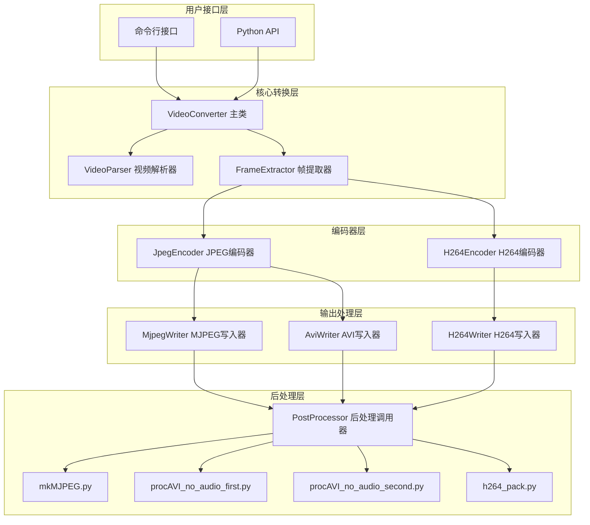

# 设计文档

## 概述

本设计文档描述了一个纯 Python 实现的视频转换工具的架构和实现细节。该工具支持将常见视频格式转换为 MJPEG、AVI-MJPEG 和 H264 格式，并调用现有的后处理脚本完成最终封装。

核心设计原则：
- 模块化设计，各组件职责清晰
- 不依赖外部程序（如 ffmpeg），使用纯 Python 库实现
- 兼容现有后处理脚本的接口
- 支持命令行和编程两种使用方式

## 架构



## 组件和接口

### 1. VideoConverter 主类

主入口类，协调整个转换流程。

```python
class VideoConverter:
    """视频转换器主类"""
    
    def __init__(self, progress_callback: Optional[Callable[[int, int], None]] = None):
        """
        初始化转换器
        
        Args:
            progress_callback: 进度回调函数，接收 (current_frame, total_frames)
        """
        pass
    
    def get_video_info(self, input_path: str) -> VideoInfo:
        """
        获取视频信息
        
        Args:
            input_path: 输入视频文件路径
            
        Returns:
            VideoInfo 对象，包含宽度、高度、帧率、帧数等信息
            
        Raises:
            FileNotFoundError: 文件不存在
            VideoFormatError: 不支持的视频格式
        """
        pass
    
    def convert(self, input_path: str, output_path: str, 
                output_format: OutputFormat,
                frame_rate: Optional[float] = None,
                quality: int = 85) -> ConversionResult:
        """
        执行视频转换
        
        Args:
            input_path: 输入视频文件路径
            output_path: 输出文件路径
            output_format: 输出格式 (MJPEG, AVI_MJPEG, H264)
            frame_rate: 目标帧率，None 表示保持原帧率
            quality: JPEG 质量 (1-100) 或 H264 CRF 值
            
        Returns:
            ConversionResult 对象，包含转换状态和输出信息
        """
        pass
```

### 2. VideoParser 视频解析器

负责解析输入视频的元数据。

```python
class VideoParser:
    """视频解析器"""
    
    def parse(self, input_path: str) -> VideoInfo:
        """解析视频文件，返回视频信息"""
        pass
```

### 3. FrameExtractor 帧提取器

负责从视频中提取帧数据。

```python
class FrameExtractor:
    """帧提取器"""
    
    def __init__(self, video_path: str, target_fps: Optional[float] = None):
        """初始化帧提取器"""
        pass
    
    def __iter__(self) -> Iterator[Tuple[int, np.ndarray]]:
        """迭代返回 (帧索引, 帧数据) 元组"""
        pass
    
    def get_frame_count(self) -> int:
        """获取总帧数"""
        pass
```

### 4. JpegEncoder JPEG 编码器

负责将帧数据编码为 JPEG 格式。

```python
class JpegEncoder:
    """JPEG 编码器"""
    
    def __init__(self, quality: int = 85):
        """
        初始化编码器
        
        Args:
            quality: JPEG 质量 (1-100)
        """
        pass
    
    def encode(self, frame: np.ndarray) -> bytes:
        """
        编码单帧为 JPEG
        
        Args:
            frame: BGR 格式的帧数据
            
        Returns:
            JPEG 字节数据（YUV420 Baseline 编码）
        """
        pass
```

### 5. H264Encoder H264 编码器

负责将帧数据编码为 H264 格式。

```python
class H264Encoder:
    """H264 编码器"""
    
    def __init__(self, width: int, height: int, fps: float, crf: int = 23):
        """
        初始化编码器
        
        Args:
            width: 视频宽度（将对齐到 16）
            height: 视频高度（将对齐到 16）
            fps: 帧率
            crf: CRF 质量值
        """
        pass
    
    def encode_frame(self, frame: np.ndarray) -> bytes:
        """编码单帧"""
        pass
    
    def flush(self) -> bytes:
        """刷新编码器缓冲区"""
        pass
```

### 6. 输出写入器

```python
class MjpegWriter:
    """MJPEG 写入器 - 将 JPEG 帧写入临时目录"""
    
    def __init__(self, output_dir: str):
        pass
    
    def write_frame(self, frame_index: int, jpeg_data: bytes) -> str:
        """写入单帧，返回文件路径"""
        pass
    
    def get_frame_paths(self) -> List[str]:
        """获取所有帧文件路径"""
        pass


class AviWriter:
    """AVI 写入器 - 生成 AVI 容器（使用 YUV420 Baseline JPEG 编码）"""
    
    def __init__(self, output_path: str, width: int, height: int, fps: float):
        pass
    
    def write_frame(self, jpeg_data: bytes) -> None:
        """
        写入 MJPEG 帧
        
        Args:
            jpeg_data: YUV420 Baseline JPEG 编码的帧数据
        """
        pass
    
    def close(self) -> None:
        """关闭文件"""
        pass


class H264Writer:
    """H264 写入器 - 写入原始 H264 流"""
    
    def __init__(self, output_path: str):
        pass
    
    def write(self, data: bytes) -> None:
        """写入数据"""
        pass
    
    def close(self) -> None:
        """关闭文件"""
        pass
```

### 7. PostProcessor 后处理调用器

```python
class PostProcessor:
    """后处理脚本调用器"""
    
    @staticmethod
    def process_mjpeg(input_dir: str, output_path: str) -> None:
        """调用 mkMJPEG.py 处理 MJPEG"""
        pass
    
    @staticmethod
    def process_avi(input_path: str, output_path: str) -> None:
        """依次调用 procAVI_no_audio_first.py 和 procAVI_no_audio_second.py"""
        pass
    
    @staticmethod
    def process_h264(input_path: str, output_path: str, fps: float) -> None:
        """
        调用 h264_pack.py 添加自定义头部
        
        h264_pack.py 功能：
        - 解析 SPS 获取视频分辨率
        - 通过 AUD 或 slice header 的 first_mb_in_slice 统计帧数
        - 生成包含分辨率、帧数、帧时间的自定义头部
        """
        pass
```

## 数据模型

```python
from dataclasses import dataclass
from enum import Enum
from typing import Optional


class OutputFormat(Enum):
    """输出格式枚举"""
    MJPEG = "mjpeg"
    AVI_MJPEG = "avi_mjpeg"
    H264 = "h264"


@dataclass
class VideoInfo:
    """视频信息"""
    width: int
    height: int
    frame_rate: float
    frame_count: int
    duration: float  # 秒
    codec: str
    file_path: str


@dataclass
class ConversionResult:
    """转换结果"""
    success: bool
    input_path: str
    output_path: str
    output_format: OutputFormat
    frame_count: int
    frame_rate: float
    quality: int
    error_message: Optional[str] = None


@dataclass
class MjpegFrame:
    """MJPEG 帧数据"""
    index: int
    offset: int
    size: int
    data: bytes
```


## 正确性属性

*属性是系统在所有有效执行中应保持为真的特征或行为——本质上是关于系统应该做什么的形式化陈述。属性作为人类可读规格和机器可验证正确性保证之间的桥梁。*

基于验收标准分析，以下是可通过属性测试验证的正确性属性：

### 属性 1：视频信息结构完整性

*对于任意* 有效的视频文件，解析返回的 VideoInfo 对象应包含所有必需字段（width、height、frame_rate、frame_count），且所有数值字段为正数。

**验证: 需求 1.4**

### 属性 2：不存在文件的错误处理

*对于任意* 不存在的文件路径字符串，调用 get_video_info 应抛出 FileNotFoundError 异常。

**验证: 需求 1.2**

### 属性 3：JPEG Baseline 编码验证

*对于任意* 输入视频帧，JPEG 编码器输出的数据应包含 SOF0 标记（0xFFC0），表明使用 Baseline DCT 编码。

**验证: 需求 2.1**

### 属性 4：帧率重采样正确性

*对于任意* 输入视频和目标帧率，输出帧数应等于 `ceil(原始时长 * 目标帧率)`，误差不超过 1 帧。

**验证: 需求 2.2, 3.2, 4.2**

### 属性 5：JPEG 质量参数有效性

*对于任意* 两个不同的质量值 q1 < q2，使用 q1 编码的 JPEG 数据大小应小于或等于使用 q2 编码的相同帧。

**验证: 需求 2.3, 3.3**

### 属性 6：MJPEG 8 字节对齐

*对于任意* 生成的 MJPEG 文件，解析出的每个 JPEG 帧的起始偏移量应为 8 的倍数。

**验证: 需求 2.5**

### 属性 7：AVI-MJPEG 8 字节对齐

*对于任意* 生成的 AVI-MJPEG 文件，每个 JPEG 帧数据的起始偏移量应为 8 的倍数。

**验证: 需求 3.5**

### 属性 7a：AVI-MJPEG Baseline JPEG 编码验证

*对于任意* AVI-MJPEG 文件中的 JPEG 帧，帧数据应包含 SOF0 标记（0xFFC0），表明使用 YUV420 Baseline DCT 编码。

**验证: 需求 3.1, 3.6**

### 属性 8：H264 尺寸 16 对齐

*对于任意* 输入视频，H264 编码输出的视频宽度和高度应均为 16 的倍数。

**验证: 需求 4.3**

### 属性 9：宽高比保持

*对于任意* 输入视频，转换后的视频内容区域（不含填充）的宽高比应与原始视频一致。

**验证: 需求 7.3**

### 属性 10：API 返回结构完整性

*对于任意* 有效的转换参数，convert 函数返回的 ConversionResult 对象应包含所有必需字段，且 success 为 True 时 output_path 指向存在的文件。

**验证: 需求 6.2**

### 属性 11：无效参数异常处理

*对于任意* 无效的转换参数（如不存在的输入文件、无效的输出格式），convert 函数应抛出适当的异常而非返回错误结果。

**验证: 需求 6.3**

### 属性 12：进度回调单调递增

*对于任意* 转换过程，进度回调接收的 current_frame 值应单调递增，且最终值等于 total_frames。

**验证: 需求 6.4**

### 属性 13：MJPEG 往返一致性

*对于任意* 有效的 MJPEG 帧序列，写入后再解析应能恢复出与原始帧内容相同的数据。

**验证: 需求 8.3**

### 属性 14：CLI 无效参数错误处理

*对于任意* 无效的命令行参数组合，CLI 应输出包含错误描述的信息并以非零状态码退出。

**验证: 需求 5.3**

### 属性 15：可选参数传递正确性

*对于任意* 指定的可选参数（帧率、质量），转换结果中的对应字段应与输入参数一致。

**验证: 需求 5.5**

## 错误处理

### 异常类型

```python
class VideoConverterError(Exception):
    """视频转换器基础异常"""
    pass


class FileNotFoundError(VideoConverterError):
    """文件不存在"""
    pass


class VideoFormatError(VideoConverterError):
    """不支持的视频格式"""
    pass


class EncodingError(VideoConverterError):
    """编码错误"""
    pass


class PostProcessError(VideoConverterError):
    """后处理脚本执行错误"""
    pass
```

### 错误处理策略

1. **输入验证**：在转换开始前验证所有输入参数
2. **文件检查**：验证输入文件存在且可读
3. **格式检测**：验证输入文件为支持的视频格式
4. **资源清理**：转换失败时清理临时文件
5. **详细日志**：记录错误发生的上下文信息

## 测试策略

### 单元测试

- 测试各组件的独立功能
- 测试边界条件和错误处理
- 使用 pytest 框架

### 属性测试

- 使用 **hypothesis** 库进行属性测试
- 每个属性测试运行至少 100 次迭代
- 测试标注格式：`**Feature: video-converter, Property {number}: {property_text}**`

### 测试覆盖

| 组件 | 单元测试 | 属性测试 |
|------|----------|----------|
| VideoParser | 格式解析、错误处理 | 属性 1, 2 |
| JpegEncoder | 编码输出验证 | 属性 3, 5 |
| FrameExtractor | 帧提取、重采样 | 属性 4 |
| MjpegWriter | 文件写入、对齐 | 属性 6, 13 |
| AviWriter | AVI 结构、对齐 | 属性 7 |
| H264Encoder | 尺寸对齐、编码 | 属性 8, 9 |
| VideoConverter | API 完整性 | 属性 10, 11, 12, 15 |
| CLI | 参数解析 | 属性 14 |

## 支持的输入格式

基于 OpenCV 的 VideoCapture，工具支持以下常见视频格式：

| 格式 | 扩展名 | 说明 |
|------|--------|------|
| MP4 | .mp4 | MPEG-4 容器，支持 H.264/H.265 编码 |
| AVI | .avi | Audio Video Interleave 容器 |
| MKV | .mkv | Matroska 容器 |
| MOV | .mov | QuickTime 容器 |
| WMV | .wmv | Windows Media Video |
| FLV | .flv | Flash Video |
| WebM | .webm | WebM 容器（VP8/VP9） |

**注意**：实际支持的格式取决于系统安装的编解码器。OpenCV 在 Windows 上使用系统编解码器，在 Linux 上通常依赖 FFmpeg 后端。

## 依赖库

```
opencv-python>=4.5.0    # 视频读取和帧处理
numpy>=1.20.0           # 数组操作
Pillow>=8.0.0           # JPEG 编码
bitstring>=4.0.0        # H264 比特流解析（h264_pack.py 依赖）
hypothesis>=6.0.0       # 属性测试
pytest>=7.0.0           # 测试框架
```

## 文件结构

```
video_converter/
├── __init__.py
├── converter.py        # VideoConverter 主类
├── parser.py           # VideoParser 视频解析器
├── extractor.py        # FrameExtractor 帧提取器
├── encoders/
│   ├── __init__.py
│   ├── jpeg.py         # JpegEncoder
│   └── h264.py         # H264Encoder
├── writers/
│   ├── __init__.py
│   ├── mjpeg.py        # MjpegWriter
│   ├── avi.py          # AviWriter
│   └── h264.py         # H264Writer
├── postprocess.py      # PostProcessor
├── models.py           # 数据模型
├── exceptions.py       # 异常定义
└── cli.py              # 命令行接口

tests/
├── __init__.py
├── test_parser.py
├── test_encoders.py
├── test_writers.py
├── test_converter.py
├── test_cli.py
└── conftest.py         # pytest 配置和 fixtures
```
